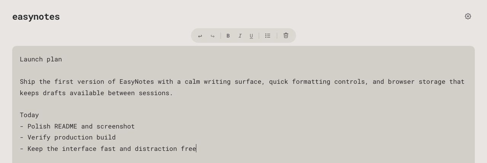

# EasyNotes



EasyNotes is a lightweight browser note editor built for fast, temporary writing. It modernizes the quick-notes flow of notes.io with a calmer interface, browser-based auto-save, rich text controls, live writing stats, and theme preferences.

Try it at [easynotes.io](https://easynotes.io).

The project is intentionally small: open the page, write what you need, and let the browser keep the draft available until you clear it or move it somewhere more permanent.

## Highlights

- Rich text editor with undo, redo, bold, italic, underline, and bullet list controls
- Plain-text paste and drop handling to keep notes clean
- Debounced browser storage auto-save using `localStorage`
- Live word and character counts
- Dark, light, and system theme preferences
- Responsive, keyboard-friendly UI built with TypeScript and Vite

## Tech Stack

- TypeScript
- Vite
- HTML and CSS
- Browser `localStorage`

## Getting Started

Install dependencies:

```bash
npm install
```

Run the development server:

```bash
npm run dev
```

Build for production:

```bash
npm run build
```

Preview the production build:

```bash
npm run preview
```

## Project Status

EasyNotes is a personal CV project focused on a polished single-page writing experience. Current work is centered on editor ergonomics, reliable browser persistence, and a minimal interface that stays out of the way.
